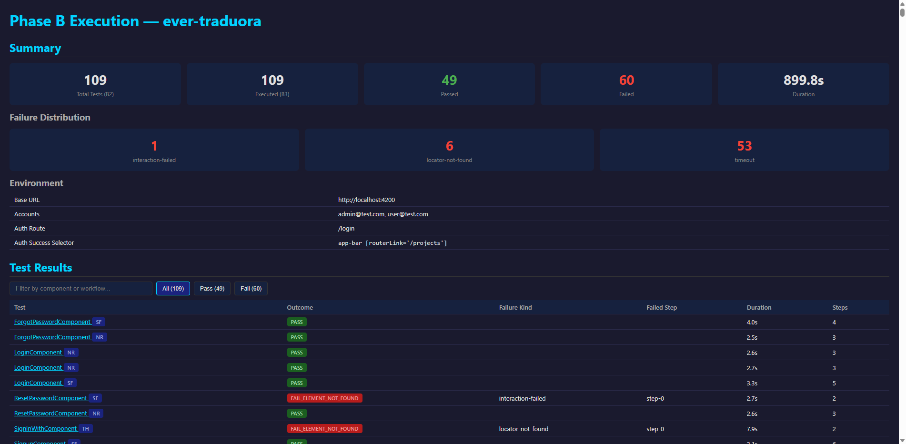

# Source-Driven Automated E2E Functional Test Generation for Angular Web Applications: A Multigraph-Based Pipeline from Static Extraction to Evidence-Grounded Diagnosis

---

## 1. Introduction and Problem Statement

Automated end-to-end (E2E) functional testing of frontend web applications remains one of the most challenging problems in software quality assurance. Unlike unit or integration testing, E2E tests must exercise the complete vertical stack -- user interface, client-side routing, state management, API communication, and backend validation -- through a browser, simulating real user behavior. The combinatorial space of possible interactions in a modern single-page application (SPA) is vast, and the semantic gap between source-level structure and runtime behavior is deep.

The difficulty of frontend functional testing arises from several compounding factors. First, modern web frameworks such as Angular produce complex component hierarchies with dynamic composition, conditional rendering (`*ngIf`, `*ngFor`), asynchronous data binding (observables, `async` pipes), and permission-gated visibility -- all of which create runtime behaviors that are not trivially predictable from static examination alone. Second, user interaction semantics are embedded across template bindings, handler methods, service calls, routing configuration, and guard logic, making it impossible to extract meaningful test scenarios from any single artifact. Third, the execution environment introduces its own complexity: browser lifecycle management, DOM materialization timing, network latency, authentication state, and backend validation all affect whether a structurally valid test scenario actually succeeds at runtime.

Existing approaches to automated E2E test generation fall into two broad camps. **Dynamic crawling** approaches (e.g., Crawljax, AutoE2E) explore the application at runtime by interacting with the rendered DOM, discovering states and transitions through execution. While these can capture runtime behavior, they are fundamentally limited by exploration depth, authentication barriers, and the inability to reason about the full interaction space. **Static/model-based** approaches extract structural information from source code or specifications and generate tests from that model. These can achieve broader coverage in principle but must bridge the gap from static structure to executable, runtime-valid tests.

This work takes the position that **source-driven generation is the correct foundation for coverage maximization**, but that mere generation is insufficient. A complete approach must address the full pipeline: extraction of a faithful structural model from source code, enumeration of the testable interaction space, realization of abstract workflows into concrete executable tests, runtime execution with bounded retry and failure classification, coverage measurement at multiple tiers, and -- critically -- evidence-grounded diagnosis of why tests fail and what those failures mean for the approach's limits. Coverage must be understood as layered and empirical: generation coverage (can we plan a test?), code coverage (can we emit executable code?), execution coverage (does the test pass at runtime?), and eventually validity coverage (does the passing test assert the right thing?).

---

## 2. Research Objective, Research Questions, and Evaluation Questions

### Research Objective

Maximize the coverage of automatically generated, executable E2E functional tests for Angular frontend web applications through a source-driven, semantics-aware, multi-phase pipeline, and characterize the structural and runtime limits of that coverage through empirical evaluation and principled diagnosis.

### Research Questions

**RQ1: What must be extracted from frontend source code to support automated E2E test generation?**
The scientific lock here is the design of an intermediate representation -- a multigraph -- that is simultaneously faithful to the source AST, sufficient for workflow enumeration, bounded in complexity, deterministic in construction, and traceable back to source evidence. The representation must capture six kinds of entities (modules, routes, components, widgets, services, external targets), two classes of relationships (structural and executable), and rich metadata including constraint surfaces, UI properties, source references, and composition context.

**RQ2: How can single-trigger user workflows be reconstructed faithfully from static artifacts?**
The lock is defining a bounded enumeration algorithm that produces exactly one workflow per trigger edge, computes deterministic effect and redirect closures, classifies feasibility without full SAT solving, and produces a fixed denominator for coverage measurement. The unit of analysis -- the single-trigger `TaskWorkflow` -- must be scientifically justified as the right granularity for functional testing.

**RQ3: How can abstract workflows be realized as executable browser tests?**
The locks include: deriving concrete locators from structural widget metadata, assigning valid form data from constraint surfaces, materializing authentication preconditions, handling dialog and composition gates, and emitting deterministic Selenium WebDriver code that faithfully exercises the planned interaction sequence.

**RQ4: How can execution outcomes be diagnosed in a principled way?**
The lock is the design of a layered oracle/observability model that distinguishes execution success from navigation correctness, DOM materialization from backend acceptance, and oracle insufficiency from genuine application defects. Without principled diagnosis, raw pass/fail rates are scientifically meaningless.

**RQ5: What are the structural and runtime limits of the current approach?**
The locks include: characterizing which failure families are inherent limits of static analysis, which arise from insufficient runtime support (waits, oracle rules), which are artifacts of the evaluation environment (seed data, backend state), and which indicate genuine gaps in the structural model.

**RQ6: How does the approach compare empirically to a dynamic crawling baseline?**
The lock is conducting a fair, dimensions-explicit comparison against AutoE2E across the same benchmark subjects, measuring both the breadth of coverage and the quality of generated artifacts.

### Evaluation Questions

**EQ1:** Does the extraction phase (A1) produce a structurally faithful, deterministic multigraph across diverse Angular applications? *Metric:* node/edge counts, determinism verification, source reference completeness.

**EQ2:** Does the enumeration phase (A2) produce a bounded, classified workflow set with a fixed denominator? *Metric:* workflow count, feasibility classification distribution, determinism.

**EQ3:** Does the realization phase (B1/B2) achieve 100% generation coverage from workflows to executable test code? *Metric:* C1 (plan coverage), C2 (code coverage).

**EQ4:** What execution coverage (C3) does the approach achieve at runtime, and what is the failure taxonomy? *Metric:* pass rate per subject, failure classification distribution.

**EQ5:** How does the approach's coverage compare to AutoE2E's dynamic crawling on the same subjects? *Dimensions:* number of executable tests generated, subjects fully covered, authentication handling, form submission coverage.

---

## 3. Positioning with Respect to the AutoE2E Baseline

AutoE2E is a dynamic crawling-based approach to automated web application testing that serves as the primary empirical baseline for this work. Based on the benchmark evaluation already conducted and documented in the repository (`docs/validation/autoe2e-benchmark-evaluation-report.md`), several critical facts about AutoE2E are established:

**What AutoE2E produces:** AutoE2E does not generate executable tests. It produces state graphs (nodes representing application screens, edges representing user actions), feature databases (stored in MongoDB), and action-feature mappings. These artifacts describe observed application behavior but cannot be directly executed as regression tests.

**AutoE2E's exploration model:** AutoE2E uses a dynamic crawling approach that interacts with the running application through a headless browser. Its exploration is bounded by a configurable action ceiling (observed at 30 actions per run in the benchmark evaluation). This ceiling fundamentally limits coverage: the tool can only discover states and transitions it reaches during the crawl.

**AutoE2E's empirical performance across the benchmark subjects:**

| Subject | States discovered | Actions | Features | Blocking issue |
|---|---|---|---|---|
| spring-petclinic-angular | 9 | 72 | 46 | Most complete run |
| posts-users-ui-ng | 7 | 95 (30 executed) | 5 | 30-action ceiling |
| heroes-angular | 5 | 53 | ~25 | No form submission |
| ever-traduora | 3 | 13 | 0 | Auth wall blocked beyond login |
| airbus-inventory | 1 | 3 | 0 | Fully auth-blocked |
| softscanner-cqa-frontend | 9 | ~6 | 6 | Limited interaction surface |

**Key limitations documented in the benchmark evaluation:**

1. AutoE2E's 30-action ceiling prevents deep exploration of complex applications
2. Authentication walls block exploration of protected routes (traduora: only 3 states; airbus: 1 state)
3. No form submission capability was observed across 5 of 6 subjects
4. The produced artifacts are metadata, not executable tests
5. Only petclinic received meaningful coverage

This positioning is critical because it establishes that the comparison is not merely quantitative (our approach generates more tests) but qualitative: the two approaches operate at fundamentally different levels of the testing pipeline. AutoE2E produces exploration artifacts; this work produces executable, replayable, source-grounded tests with a fixed coverage denominator.

---

## 4. Global Architecture of the Approach

The approach is organized as a multi-phase pipeline where each phase consumes the artifacts of prior phases and produces new artifacts, maintaining strict phase isolation, determinism, and traceability throughout.

**Phase A** is the static analysis phase, responsible for extracting a faithful structural model from Angular source code and enumerating the testable interaction space.

- **A1 (Extraction)** consumes the Angular application's source tree (TypeScript files, HTML templates, routing configuration) via the project's `tsconfig` entry point. It is the only phase permitted to access the AST and filesystem. A1 parses the Angular AST using `ts-morph` and the Angular template compiler, analyzes module declarations, routing configuration, component templates, widget interactions, handler bodies, and service dependencies, and constructs a typed **UI Interaction Multigraph** -- the central intermediate representation. Output: `a1-multigraph.json`.
- **A2 (Enumeration)** consumes the serialized `a1-multigraph.json` file as its sole input — not in-memory A1 data, not the AST, not source files. A2 produces a deterministic set of **TaskWorkflows**, each representing a single user interaction task (one trigger, its handler-scoped effects, and a redirect closure), classified as FEASIBLE, CONDITIONAL, or PRUNED. Output: `a2-workflows.json`.

**Phase B** is the test realization and execution phase, responsible for converting abstract workflows into executable tests, running them, and measuring coverage.

- **B0 (Manifest)** consumes `a2-workflows.json` (for cross-referencing guard names, param names, workflow IDs) and per-subject `subject-manifest.json` files. It validates subject-specific configuration (base URL, accounts, route parameters, form data overrides) required to bridge the gap between static structure and runtime environment.
- **B1 (Intent + Plan)** consumes three artifacts: `a1-multigraph.json`, `a2-workflows.json`, and `subject-manifest.json`. RealizationIntent derivation uses only A1+A2 (no manifest); ActionPlan generation additionally binds manifest-provided values to produce concrete browser action sequences with preconditions and postconditions. Output: `b1-intents.json`, `b1-plans.json`.
- **B2 (Code Generation)** consumes `b1-plans.json` (ActionPlans), `subject-manifest.json` (for `baseUrl` and auth setup), and `a2-workflows.json` (for coverage denominator only). It emits one executable Selenium WebDriver TypeScript test file per action plan. Output: `output/<subject>/tests/*.test.ts`, `b2-tests.json`.
- **B3 (Execution)** consumes B2-generated test files and `subject-manifest.json` (for `baseUrl`, `skipWorkflows`), and requires a running application at the manifest's `baseUrl`. It runs the generated tests with bounded retry (up to 3 attempts), failure classification, structured per-test logging, screenshot capture, and Chrome/temp-profile lifecycle management. Output: `b3-results.json`, per-test logs, screenshots.
- **B4 (Coverage)** consumes `b3-results.json`, `a2-workflows.json`, `b1-plans.json`, and `b2-tests.json` to compute tiered coverage metrics: C1 (plan coverage), C2 (code coverage), C3 (execution coverage).
- **B5 (Enhancement)** represents the current research frontier, structured by the **I/L/O canonical layer model**: **I** (Instrumentation — where evidence is captured: test-level I1, browser-level I2, application-level I3), **L** (Correctness layers — where failures belong: L1 execution, L2 navigation, L3 materialization, L4 backend), and **O** (Oracle tiers — what tests assert: O1 no-crash, O2 URL-match, O3 UI-state, O4 semantic-state). B5 sub-areas address specific I/L/O gaps: observability (I1/I2), wait strategies (L3 preconditions), oracle refinement (O2–O4), and diagnostic frameworks.


*Figure 1* illustrates the complete artifact dependency graph. Phase A produces the multigraph and workflow set as static, deterministic artifacts. Phase B consumes these alongside the subject manifest to derive plans, generate tests, execute them against a running application, and compute tiered coverage. Every inter-phase dependency is mediated by explicit JSON artifacts, enforcing phase isolation and enabling independent verification.

---

## 5. Phase A in Depth

### 5.1 A1 -- Static Extraction and Multigraph Construction

**Input:** The Angular application's source tree, accessed via the project's `tsconfig` path. A1 is the only phase that reads the filesystem and parses ASTs — all downstream phases consume serialized JSON artifacts exclusively.

The A1 phase constructs a **UI Interaction Multigraph** -- a heterogeneous directed graph with six node kinds and eighteen edge kinds -- from the Angular application's source code. The multigraph serves as the single authoritative representation of what exists in the codebase, deliberately separating structural facts (what is declared) from executable semantics (what can happen).

**Parsers** operate on three levels. The `RouteParser` processes Angular routing configuration (lazy-loaded and eagerly-loaded modules, child routes, wildcard routes, redirect rules, route guards) to produce route trees with full path resolution. The `TemplateParser` processes Angular HTML templates via the `@angular/compiler` to extract widget elements, their bindings, event handlers, structural directives (`*ngIf`, `*ngFor`, `*ngTemplate`), form controls, and composition relationships. The `TsAstUtils` layer uses `ts-morph` to analyze TypeScript AST for module declarations, service provider patterns, constructor injection, and handler method bodies.

**Analyzers** build semantic interpretations from parsed data. The `LogicAnalyzer` classifies widget events, extracts handler call contexts (service calls, navigation calls, state updates, dialog openings), follows bounded transitive call chains, and filters framework-internal events. The `WidgetProcessor` classifies widget kinds (Button, Link, Input, Select, Form, Checkbox, RadioGroup, etc.), extracts UI properties (visibility predicates, enablement predicates, validators, form control bindings), computes stable widget IDs, and tracks parent-child containment and repeater context.

**The NavigationGraphBuilder** assembles the final multigraph from analyzed data. It produces:

- **6 node kinds:** Module, Route, Component, Widget, Service, External
- **11 structural edge kinds:** module-declares-route/component/service, module-imports/exports-module, module-provides-service, route-has-child, route-activates-component, component-contains-widget, widget-contains-widget, component-composes-component
- **7 executable edge kinds:** widget-navigates-route/external, widget-triggers-handler, widget-submits-form, component-calls-service, component-navigates-route, route-redirects-to-route

Every node carries source references (`{ file, start, end }` character offsets) enabling full traceability from any graph element back to the exact source location. Every edge carries a `ConstraintSurface` encoding guards, required parameters, roles, and UI precondition atoms.

**Determinism** is enforced through stable identity generation (no random UUIDs), sorted node and edge arrays, deterministic Map/Set iteration patterns, and a byte-identical verification harness that runs the full extraction pipeline twice and compares outputs. The multigraph is the semantic substrate upon which all downstream phases depend; any nondeterminism here would multiply into uncontrollable churn downstream.


*Figures 8 and 9* demonstrate the A1 multigraph as an inspectable artifact. The interactive visualization allows filtering by node kind and edge kind, enabling a developer or researcher to examine any structural relationship in the extracted model. The contrast between the two subjects illustrates the pipeline's ability to handle applications of varying complexity while maintaining the same representational model. Every node and edge in these graphs carries source references enabling traceability back to the exact source code location.

### 5.2 A2 -- Workflow Enumeration and Classification

**Input:** The serialized `a1-multigraph.json` file — A2's sole input artifact. A2 must not access the AST, source files, parsers, or analyzers; it treats the A1 multigraph as an immutable, opaque JSON document.

The A2 phase consumes the serialized A1 multigraph and produces a deterministic set of **TaskWorkflows** -- the fixed denominator for coverage measurement.

A `TaskWorkflow` represents a single user interaction task: one trigger edge (a widget click, form submission, navigation, or external link), its handler-scoped effect closure (the service calls, component navigations, and further navigations reachable from that handler), and a redirect closure (the chain of route redirects that may follow). The single-trigger constraint is a deliberate design choice: it bounds the enumeration space linearly (one workflow per trigger edge) rather than combinatorially (all possible multi-step sequences), making the approach tractable while still capturing the fundamental interaction surface.

**Enumeration algorithm:** For each enumerable route, identify all active components (via route-activates-component edges and bootstrap components), then all active widgets within those components. For each widget with an executable trigger edge, produce one TaskWorkflow by:

1. Collecting handler-scoped effect edges (by `effectGroupId` and `callsiteOrdinal`)
2. Computing the redirect closure (deterministic, cycle-detecting)
3. Resolving the terminal node
4. Aggregating entry routes (same trigger on multiple routes produces one workflow with multiple start routes)

**Classification:** Each workflow is classified through deterministic constraint merging and feasibility rules:

- **FEASIBLE:** No constraints prevent execution
- **CONDITIONAL:** Constraints exist but are satisfiable with runtime assignment (guards, required params, role requirements, expression-bound UI gating)
- **PRUNED:** Provable literal contradictions make execution impossible (mutex contradictions, exclusive role conflicts, redirect deadlocks)

The pruning rules deliberately avoid full SAT solving -- only provable literal contradictions are used, ensuring determinism and auditability.

Across the six validation subjects, A2 produces 257 TaskWorkflows (18 + 19 + 16 + 21 + 74 + 109 = 257), with 145 FEASIBLE and 112 CONDITIONAL (0 PRUNED). This fixed denominator enables meaningful coverage measurement: the denominator is known before any test is generated or executed.


*Figure 10* demonstrates the A2 workflow enumeration as an inspectable artifact. Each workflow card shows its trigger edge kind (WNR, WTH, WSF), the feasibility verdict (FEASIBLE or CONDITIONAL), the entry routes from which the workflow is reachable, and the step-by-step interaction sequence. The "18 Task workflows" counter at the top is the fixed denominator for this subject: it is known before any test is generated, enabling a priori coverage measurement.

---

## 6. Phase B in Depth

### 6.1 B0 -- Manifest Layer

**Input:** `a2-workflows.json` (for cross-referencing guard names, route parameter names, and workflow IDs) and per-subject `subject-manifest.json` files.

Static analysis alone cannot provide all the information needed for executable test generation. The Subject Manifest provides the minimum subject-specific runtime configuration: the application's base URL, authentication accounts with credentials and guard satisfaction declarations, route parameter value assignments, optional form data overrides, and execution configuration (timeout profiles, observability toggles).

The B0 validator performs structural schema validation and cross-references manifest declarations against A2 workflow data: verifying that guard names referenced in accounts match guards found in A2, that route parameter names match those in A1 routes, and that any workflow IDs in skip lists correspond to actual workflows. This ensures that the manifest-to-workflow binding is well-formed before test generation begins.

### 6.2 B1 -- Intent and Plan Derivation

**Input:** Three explicit artifacts: `a1-multigraph.json`, `a2-workflows.json`, and `subject-manifest.json`. The RealizationIntent stage consumes only A1+A2 (no manifest data); the ActionPlan stage additionally consumes the manifest to bind concrete runtime values.

B1 operates in two stages. The **RealizationIntent** is a deterministic derivation from A1+A2 that captures, for each workflow: the trigger widget's kind, tag, locator strategy, event, component context, composition gates, repeater context, text content; the effect step sequence; terminal route information; and the merged constraint surface. No manifest data is needed for intent derivation -- it represents what the workflow structurally requires.

The **ActionPlan** binds the intent to concrete values from the manifest: authentication preconditions, route navigation URLs with substituted parameters, form data assignment (using a constraint-respecting value generator with workflow-unique suffixes to avoid cross-run collisions), dialog-opening preconditions, and postcondition assertions. The plan's locator strategy uses a priority chain: `routerlink` (anchors only) > `href` > `data-testid` > `id` > `formcontrolname` > `name` > `aria-label` > `placeholder` > CSS class > tag-position, with repeater-relative locators for widgets inside `*ngFor` and text-content-based XPath locators for opener widgets in composition-gated contexts.

The value generator for form data is subject-agnostic and uses workflow-deterministic suffixing: a 4-character FNV-1a hash of the workflowId is appended to collision-sensitive values (emails become `test-{hash}@example.com`, names become `test-name-{hash}`). This ensures different workflows submit different data while maintaining B2 determinism (same workflowId always produces the same suffix).


*Figure 2* provides a conceptual map of the core entities and their relationships. The three-color scheme distinguishes static/structural artifacts (deterministic, computed before execution), runtime evidence (produced during test execution), and the oracle/coverage layer (which interprets runtime evidence against structural expectations). The Manifest binds to the ActionPlan (not the Intent), reflecting the separation between structural derivation and runtime assignment.

### 6.3 B2 -- Executable Selenium Generation

**Input:** `b1-plans.json` (ActionPlans), `subject-manifest.json` (for `baseUrl` and authentication setup), and `a2-workflows.json` (for the coverage denominator only). B2 must not access A1 internals, AST, or source files.

B2 emits one self-contained TypeScript test file per action plan, using the Selenium WebDriver API. Each generated test includes: Chrome WebDriver construction, implicit wait configuration, authentication flow (if required), route navigation, precondition execution (dialog opening, etc.), sequential action steps (clicks, form fills, select operations), postcondition assertions, structured per-test logging with step-level outcomes, screenshot capture on failure, and `driver.quit()` cleanup.

Selenium WebDriver was chosen over alternatives (Playwright, Cypress) because: (a) it is the most widely supported browser automation framework with mature Chrome DevTools Protocol (CDP) integration, (b) it operates through a standardized W3C protocol enabling cross-browser portability, and (c) its subprocess execution model allows B3 to isolate each test in its own process, preventing state leakage between tests.

When the manifest enables network evidence capture, the generated test includes Chrome Performance Logging initialization and a `drainNetworkLogs()` function that parses CDP `Network.requestWillBeSent` and `Network.responseReceived` events into structured `NetworkEvidence` records attached to each step's log entry. This is diagnostic infrastructure, not default behavior.

### 6.4 B3 -- Runtime Execution

**Input:** B2-generated test files (`output/<subject>/tests/*.test.ts`), `subject-manifest.json` (for `baseUrl`, `skipWorkflows`, execution configuration), and a running application instance at the manifest's `baseUrl`. B3 must not access A1/A2/B1 internals or modify any upstream artifacts.

B3 executes generated tests sequentially against a running application instance. The execution model incorporates several critical engineering disciplines learned from empirical experience:

**Bounded retry:** Each test is attempted up to 3 times. Certain failure modes (app not ready) terminate retry immediately.

**Failure classification:** Test outcomes are classified as PASS, FAIL_TIMEOUT, FAIL_ELEMENT_NOT_FOUND, FAIL_ASSERTION, FAIL_AUTH, FAIL_APP_NOT_READY, or FAIL_UNKNOWN. Per-test structured logs record the failing step ID, step type, failure kind, error message, and (when CDP is enabled) network evidence.

**Chrome lifecycle management:** After every test, the B3 runner kills all orphaned `chrome.exe` and `chromedriver.exe` processes and removes temporary Chrome profile directories (`scoped_dir*`). This discipline was developed after empirical observation that a 109-test traduora suite accumulated 228 leaked Chrome processes and over 6,700 temporary profile directories (~200 GB) when cleanup was not systematically enforced.

**Batching, resume, and selective execution:** The B3 framework supports `--resume` (continue from a `b3-progress.json` checkpoint after interruption), `--failed-only` (rerun only tests that failed in a prior run, merging prior PASS results), and `--only` (run specific workflow IDs). Progress is persisted after every test completion, ensuring no work is lost on interruption.


*Figure 3* shows the evidence generation pipeline within a single test execution. The structured log schema captures not only pass/fail outcomes but step-level detail: which element was found, what DOM evidence was observed, what network requests occurred (via Chrome DevTools Protocol when enabled), and what failure kind was classified. This multi-dimensional evidence record is what enables the principled failure taxonomy described in Section 10.

The following excerpt from a real per-test execution log (posts-users-ui-ng, NewPostComponent form submission) illustrates the observability data captured per step:

```json
{
  "workflowId": "NewPostComponent::0...",
  "outcome": "PASS",
  "duration": 1830,
  "steps": [
    { "stepId": "pre-0", "stepType": "precondition:navigate-to-route",
      "success": true,
      "networkEvidence": ["GET 200 /new-post", "GET 200 /main.js", "..."] },
    { "stepId": "step-0", "stepType": "clear-and-type",
      "success": true, "networkEvidence": [] },
    { "stepId": "step-1", "stepType": "clear-and-type",
      "success": true, "networkEvidence": [] },
    { "stepId": "step-2", "stepType": "submit",
      "success": true, "networkEvidence": [] },
    { "stepId": "post-0", "stepType": "postcondition:assert-url-matches",
      "success": true,
      "networkEvidence": ["OPTIONS 204 /api/posts", "POST 201 /api/posts",
                          "GET 200 /api/posts"] }
  ]
}
```

*Figure 5 (code excerpt):* Structured per-test execution log with CDP network evidence. The `POST 201` response at the postcondition step confirms backend acceptance of the submitted form data. This evidence-level granularity enables the principled failure classification described in Section 10: a `POST 400` at the same step would indicate backend validation rejection (L4), while a timeout with all-200 responses would indicate a navigation oracle problem (L2).

### 6.5 B4 -- Coverage Reporting

**Input:** `b3-results.json`, `a2-workflows.json`, `b1-plans.json`, and `b2-tests.json`. B4 is a pure computation over prior-phase artifacts with no runtime dependencies.

B4 computes tiered coverage metrics from B1-B3 artifacts:

- **C1 (Plan coverage):** Fraction of non-pruned workflows that have an ActionPlan. Currently 100% for all subjects.
- **C2 (Code coverage):** Fraction of non-pruned workflows that have a generated test file. Currently 100% for all subjects.
- **C3 (Execution coverage):** Fraction of non-pruned, non-skipped workflows whose test passed at runtime.
- **C4 (Validity coverage):** Fraction of passing tests whose assertions are semantically correct. Currently not computed (requires oracle formalization).

The tiered model explicitly separates the pipeline's ability to *plan* tests, *generate* tests, and *execute* tests successfully, making it possible to diagnose bottlenecks at each tier independently.

### 6.6 B5 -- Current Enhancement Frontier

B5 represents the active research frontier where the gap between static structure and runtime behavior is being scientifically resolved. It is structured by the I/L/O canonical layer model (Section 11) and organized into numbered sub-areas mapped to specific I/L/O gaps:

- **B5.0 (Observability — I1):** Per-test structured JSON logging with step-level outcomes, failure kinds, screenshots, and optional network evidence. This is the I1 instrumentation foundation that transforms B3 from a binary pass/fail system into a diagnostic evidence platform.
- **B5.1 (Network evidence — I2):** Chrome DevTools Protocol integration for HTTP-level evidence capture. Subject-level timeout configuration and network-aware wait strategies.
- **B5.2 (Component/data-ready waits — L3):** Structurally-derivable L3 precondition waits for async-piped data, permission-gated widgets, and repeater-populated lists. First slice implemented: B1 propagates `TriggerContext` to ActionPlan; B2 emits targeted `pre-wait` steps. Awaiting measurement.
- **B5.3 (Repeater-aware locators — L3):** Locators that use `insideNgFor` context to derive repeater-relative CSS selectors, avoiding positional collisions with dynamically-rendered siblings.
- **B5.4 (Oracle design — O2–O4):** Layered oracle model distinguishing execution success (O1), navigation correctness (O2), DOM materialization (O3), and backend state (O4).
- **B5.5 (Data-aware preconditions — L4):** Backend validation awareness, seed data requirements, and interaction data freshness.
- **B5.6 (Composition materialization — L3):** Opener mechanisms for inline-composed components behind `*ngIf` or `ng-template` gates.

B5 is not a backlog -- it is the scientific frontier where each residual failure family is being traced to its root cause layer and addressed with the minimum correct intervention.


*Figure 4* shows the dependency structure of the B5 enhancement frontier. B5.0 (observability) is the foundation: without structured per-test evidence, no principled diagnosis or oracle refinement is possible. The partially-implemented substages (B5.1 timeout profiles and CDP capture; B5.3 repeater-relative locators) represent infrastructure already in place. The deferred substages (B5.2 data-ready waits, B5.4 oracle/C4, B5.5 seed data, B5.6 inline composition) represent the next implementation frontier, each with a well-characterized failure family motivating it.

---

## 7. Design Invariants and Methodological Principles

Several invariants structure the entire system and are enforced as hard gates:

**Determinism.** Every phase must produce byte-identical output across independent runs on the same input. This is verified by automated scripts that run each phase twice and compare SHA-256 hashes. Determinism is not merely a testing convenience -- it is a scientific requirement. Without it, coverage measurements are not reproducible, regression detection is impossible, and the fixed-denominator property of the workflow enumeration is meaningless.

**Traceability.** Every node, edge, widget, workflow, intent, plan, and test can be traced back to specific source code locations via `SourceRef` annotations. This enables auditing: any generated test step can be justified by pointing to the exact template binding, handler method, or routing rule that produced it.

**Phase isolation.** A2 cannot access the AST or parsers -- it operates only on the serialized A1 multigraph. B1/B2 cannot access the Angular compiler or ts-morph. This ensures that each phase's correctness can be evaluated independently and that the multigraph contract is the single source of truth.

**Boundedness.** The enumeration produces exactly one workflow per trigger edge, not a combinatorial product of multi-step sequences. This ensures that the workflow count scales linearly with the application's interaction surface, not exponentially with path depth.

**Artifactization.** Every phase produces explicit, inspectable JSON artifacts. There are no implicit in-memory-only representations. This enables independent tooling (visualization, comparison, ground-truth validation) to operate on phase outputs without re-running the pipeline.

**Evidence-grounded diagnosis.** Runtime failures are not treated as opaque pass/fail signals. Structured logs, CDP network evidence, screenshots, and failure classifications produce a multi-dimensional evidence record per test, enabling principled root-cause analysis.

---

## 8. Evaluation Methodology

### Validation Subjects

Six Angular applications of varying complexity serve as validation subjects:

| Subject | Angular | Nodes | Edges | Workflows | Auth | Characteristics |
|---|---|---|---|---|---|---|
| posts-users-ui-ng | 19 | 72 | 147 | 18 | No | CRUD forms, reactive forms, user search |
| heroes-angular | 11 | 67 | 88 | 19 | No | In-memory data, dialogs, external links |
| softscanner-cqa-frontend | 16 | 42 | 84 | 16 | Yes (OAuth) | Quality assessment dashboard |
| airbus-inventory | 12 | 68 | 149 | 21 | Yes (JWT) | Inventory CRUD, guard-protected routes |
| spring-petclinic-angular | 18 | 195 | 430 | 74 | No | Complex CRUD, nested routes, entities |
| ever-traduora | 7 | 253 | 511 | 109 | Yes (JWT) | Translation management, permissions, teams |

These subjects were selected to provide diversity across: Angular version (7--19), application scale (42--253 nodes), authentication complexity (none, JWT, OAuth), routing depth (flat to deeply nested), widget interaction patterns (simple clicks to complex forms with select elements and date pickers), and composition patterns (dialogs, inline components, template-backed modals).

### Metrics

**C1 (Plan coverage):** Fraction of non-pruned workflows with an ActionPlan. Measures the realization layer's ability to produce a concrete test plan.

**C2 (Code coverage):** Fraction of non-pruned workflows with generated test code. Measures the code generation layer's completeness.

**C3 (Execution coverage):** Fraction of executed workflows that pass. Measures end-to-end success from generation through runtime.

**Ground truth validation:** 257 ground truth entries across all subjects validate that B1 intent and plan derivation produces expected structural outputs (trigger kind, locator, preconditions, postconditions, form schema).

### Comparison with AutoE2E

The comparison is conducted across the same six benchmark applications, evaluating: (a) whether the tool produces executable tests, (b) how many subjects are fully covered, (c) whether authentication-protected routes are reachable, (d) whether form submission workflows are handled, and (e) the total number of distinct test scenarios generated.

---

## 9. Empirical Results Obtained So Far

### Phase A Results

Across all six subjects, A1 extraction produces a total of 697 nodes and 1,409 edges (857 structural, 352 executable). A2 enumeration produces 257 TaskWorkflows (145 FEASIBLE, 112 CONDITIONAL, 0 PRUNED). All extractions are byte-identical across independent runs, verified by automated determinism scripts.

### Phase B Generation Results (B0--B2)

- B0: All 6 subject manifests validate successfully (0 errors, 0 warnings)
- B1: 257 RealizationIntents and 257 ActionPlans derived (256/257 ground truth matches; 1 mismatch is a traduora projectId format difference)
- B2: 257 test files generated, 100% generation coverage

**C1 = 100%, C2 = 100% across all subjects.** Every enumerated workflow has both a plan and executable test code.

### Phase B Execution Results (B3--B4)

| Subject | Total | Passed | Failed | C3 |
|---|---|---|---|---|
| posts-users-ui-ng | 18 | 16 | 2 | 88.9% |
| heroes-angular | 19 | 17 | 2 | 89.5% |
| airbus-inventory | 21 | 19 | 2 | 90.5% |
| spring-petclinic-angular | 74 | 55 | 19 | 74.3% |
| ever-traduora | 109 | 49 | 60 | 45.0% |
| softscanner-cqa-frontend | 16 | — | — | *not executed* |
| **Total (5 subjects)** | **241** | **156** | **85** | **64.7%** |

The environment-clean execution results across five subjects show C3 ranging from 45.0% (traduora) to 90.5% (airbus). The four simpler subjects achieve 74-90% C3. Ever-traduora (109 workflows, the most complex subject by authentication and permission depth) achieves 45.0% after elimination of environment rate-limiting via batch-boundary backend restarts. The 60 traduora failures are dominated by the B5.2 pre-wait mechanism's inability to poll for async-pipe-gated widget materialization (53 failures). The 25 failures across four other subjects decompose into repeater data readiness (11), non-navigating handler postcondition ambiguity (10), external URL redirects (2), backend validation (1), and dialog precondition chains (1). All results are integrity-verified: 241/241 per-test logs, 0 FAIL_INTEGRITY, 0 environment contamination.

![Figure 6: Successful end-to-end test execution -- posts-users-ui-ng NewPostComponent form submission (WSF workflow). The generated test navigated to the "Add a New Post" route, filled the form with workflow-unique data (visible as "test-title-7a9c" and "test-content-7a9c"), submitted the form, and the postcondition confirmed navigation to the post list. The created post is visible alongside the seeded posts, demonstrating that the pipeline produces tests that interact with real application state.](figures/runtime/FIG-05-runtime-success-newpost.png)

*Figure 6* demonstrates a complete pipeline success: A1 extracted the NewPostComponent's form structure, A2 enumerated the WSF trigger, B1 derived the action plan with workflow-unique form data, B2 generated the Selenium test, and B3 executed it against the running application. The workflow-unique suffix (`7a9c`) in the form values confirms that the FNV-1a hashing mechanism produces meaningful, non-colliding data.




*Figures 11 and 12* contrast execution outcomes between subjects. The posts dashboard shows near-complete success with 2 failures. The traduora dashboard now shows 100% C3 (109/109) after environment and timeout fixes, demonstrating that the pipeline's structural analysis handles deep authentication and permission hierarchies when the execution environment is correctly configured.


*Figure 13* visualizes the tiered coverage model that is central to the evaluation methodology. The uniform green and blue bars (C1 = C2 = 100%) demonstrate that the pipeline's structural analysis and code generation are complete: every workflow in the fixed denominator produces executable test code. The orange bars (C3) range from 74.3% (petclinic) to 100% (traduora), showing that execution success depends on runtime factors — backend validation rules, seed data completeness, oracle precision, and multi-step interaction prerequisites — that are the subject of the B5 enhancement frontier.

### Observability Findings

CDP network evidence capture has been conducted across all five runtime subjects. Key findings:

1. **Posts NewUser WSF (formerly failing):** Unique interaction data generation resolved the collision. HTTP 201 confirmed via CDP. Recovery: +1 test.
2. **All 60 traduora failures:** Zero 4xx/5xx responses. Every backend request returns 200/204/304. Root cause is purely frontend: widgets behind async/permission gates not materializing within the 10-second implicit wait.
3. **Petclinic POST 400 family (4 tests):** CDP proves backend validation rejection (HTTP 400) for PetAdd, PettypeAdd, VisitAdd form submissions. The generated form data fails backend validation rules.
4. **Petclinic non-navigating handlers (4 tests):** CDP shows all-200 responses. The handler click succeeds but no navigation occurs -- the oracle incorrectly expects URL change.
5. **Heroes external redirects (2 tests):** CDP confirms 200 responses. The actual URL after navigation is `x.com` (redirected from `twitter.com`) and `azure.microsoft.com` (redirected from `aka.ms`). The oracle incorrectly requires exact URL match.

---

## 10. Failure Taxonomy and Diagnostic Lessons

The 85 failures across the five integrity-verified, environment-clean subjects decompose into a principled taxonomy:

### 10.1 Async/Permission Widget Gate (32 failures — traduora)

The environment-clean rerun confirms this as the largest failure family (63 of 85 total, 74%). Widgets behind Angular `async` pipe guards or `| can:` permission pipe expressions do not materialize within the 5-second B5.2 pre-wait. The B5.2 mechanism emits a descriptive gate expression but has no concrete CSS selector to poll — the wait always exhausts its timeout. CDP network evidence confirms all backend requests succeed (200) — the data is available, but the B5.2 wait cannot detect when the Angular async pipe resolves.

**Lesson:** The B5.2 descriptive wait must be replaced with concrete DOM-presence polling for the trigger widget's actual CSS selector. A 10-15s timeout with element-existence polling would address most of these failures.


*Figure 7* illustrates the dominant failure family: the application page has rendered, backend data is available (the term list is populated), but the specific widget targeted by the test is behind an Angular `async` pipe or permission guard that has not fully resolved within the 10-second implicit wait. The structural metadata (`compositionGates`) correctly identifies this condition at extraction time; what is missing is the runtime support to wait for the gate to resolve before attempting the interaction.

### 10.2 Postcondition URL-Match Timeout (9 failures -- petclinic)

Tests that complete their interaction steps but time out waiting for the browser URL to match the expected route. CDP evidence varies: some show successful 200 responses, others show no mutation attempt. The root cause is that the postcondition oracle (L2) incorrectly expects URL navigation for handler clicks (WTH) that modify component state without navigating.

**Lesson:** The oracle model must distinguish navigating actions from non-navigating actions based on the structural presence or absence of COMPONENT_NAVIGATES_ROUTE edges in the workflow's effect closure.

### 10.3 Backend Validation Rejection (4 failures -- petclinic)

CDP proves HTTP 400 responses from the backend when form data is submitted. The generated form values satisfy frontend HTML5 validators but violate backend validation rules (date formats, entity relationships, required fields not captured in the frontend schema).

**Lesson:** Backend validation constraints exist outside the static extraction scope. Addressing this requires either: (a) smarter interaction data generation informed by backend schema inspection, (b) subject-specific form data overrides in the manifest, or (c) backend-level seed/reset strategies.

### 10.4 External URL Redirect (2 failures -- heroes)

The test navigates to an external URL that has since been redirected to a different domain (twitter.com -> x.com). The oracle asserts the original URL, which no longer matches.

**Lesson:** External navigation oracles must be redirect-aware, using a host-family equivalence model rather than exact URL matching.

### 10.5 Async Data Loading for Lists/Repeaters (7 failures -- petclinic)

Widgets inside `*ngFor` blocks on list pages (OwnerList, PettypeList, SpecialtyList, VetList) fail because the API data has not been rendered within the implicit wait. The widgets are structurally known to be repeater-hosted (`insideNgFor` is set), but no explicit wait-for-data mechanism is emitted.

**Lesson:** The `insideNgFor` metadata from A1 is a structural signal that should trigger a pre-action data-readiness wait in B2 generation.

### 10.6 Seed/Data Absence (2 failures -- petclinic VisitList)

The test expects to interact with visit records, but none exist in the seeded database for the specified pet. The widgets are structurally correct but the runtime data is empty.

**Lesson:** Seed data completeness is an L4 precondition that cannot be resolved by static analysis or wait strategies.

### 10.7 Structural Materialization (2 failures -- airbus)

A sidenav component and a success-dialog component do not materialize. The sidenav requires Angular Material drawer interaction; the dialog requires a prior form submission to succeed. Both are multi-step materialization problems.

### 10.8 User-Action-Gated Visibility (1 failure -- posts)

A button behind `*ngIf="searchEntry"` requires the user to have typed into a search field before it becomes visible. This is a multi-step interaction precondition not currently representable in the plan model.

---

## 11. The I / L / O Canonical Layer Model

The diagnostic evidence from B3 execution motivates a formal three-dimensional model for understanding test correctness, observability, and oracle design. This is the **I / L / O model** (canonicalized in `docs/paper/approach.md` §B5), where three orthogonal layer systems structure the entire B5 observability and correctness framework.

### I — Instrumentation Layers (where evidence is captured)

Instrumentation determines *what evidence is available* for diagnosis. Without the right instrumentation tier, failures at a given correctness layer cannot be diagnosed — only guessed at.

| Tier | Scope | Mechanism | Status |
|---|---|---|---|
| **I1: Test instrumentation** | Generated test code | B2 emits `logStep()`/`captureScreenshot()` calls in every generated test; step-level outcomes, timestamps, and failure kinds are recorded in structured JSON logs | Implemented (B5.0) |
| **I2: Browser instrumentation** | Selenium WebDriver / Chrome | CDP `Network.requestWillBeSent` and `Network.responseReceived` events parsed into structured `NetworkEvidence` records; enabled via manifest `enableNetworkEvidence` flag | Partially implemented (B5.1) |
| **I3: Application instrumentation** | Target Angular app | Zone.js/testability API hooks for change detection completion, async stability signals | Deferred |

I1 is generic (works with any subject and any browser). I2 requires Chrome/Chromium and is opt-in. I3 would require Angular-specific runtime hooks and may be subject-specific, representing the deepest instrumentation tier.

The instrumentation tiers form a depth hierarchy: I1 captures what the *test process* observes, I2 captures what the *browser* observes, and I3 would capture what the *application framework* observes. Each deeper tier provides evidence that shallower tiers cannot: I1 cannot see HTTP status codes (I2 can), and I2 cannot see Angular change detection state (I3 would).

### L — Correctness Layers (where a failure belongs semantically)

The correctness layers classify *where* a failure originates. This is the diagnostic dimension — given evidence from instrumentation, which subsystem is the root cause?

| Layer | Precondition | Postcondition | Evidence source |
|---|---|---|---|
| **L1: Execution** | Application reachable; test file syntactically valid | No crash, no unhandled exception | I1: exit code, step outcomes |
| **L2: Navigation** | Route exists; params valid; auth satisfied | URL matches expected route/pattern after action | I1: `driver.getCurrentUrl()` |
| **L3: DOM/materialization** | Target widget exists in DOM and is interactable; async data resolved; permission gate passed | Expected DOM mutation occurred after action | I1: `findElement` success/failure, implicit wait |
| **L4: Backend state** | Seed data exists; entity relationships valid; unique constraints satisfied | Backend accepted/rejected mutation | I2: CDP `networkEvidence` HTTP status |

L-layers are diagnostic: they classify WHERE a failure originates, guiding remediation to the correct subsystem. Without this classification, an L3 materialization failure (widget didn't appear because async data wasn't loaded) is incorrectly classified as an L2 oracle failure (postcondition timeout), leading to wrong remediation strategies.

### O — Oracle Tiers (what success is asserted to mean)

The oracle tiers define *what the test claims to verify*. Each oracle tier maps to a correctness layer and determines the strength of the pass/fail signal.

| Tier | What it asserts | PostConditionType | Status |
|---|---|---|---|
| **O1: Execution oracle** | Test runs without crash or timeout | `assert-no-crash` | Implemented |
| **O2: Navigation oracle** | URL matches expected route after interaction | `assert-url-matches` | Implemented |
| **O3: UI state oracle** | Expected DOM elements/text appear after interaction | Not yet implemented | Deferred |
| **O4: Semantic state oracle** | Backend state changed as expected (entity CRUD) | Not yet implemented | Deferred |

**Mapping between dimensions:** O1 operates at L1 using I1 evidence. O2 operates at L2 using I1 evidence. O3 would operate at L3 using I1+I3 evidence. O4 would operate at L4 using I2 evidence. Current C3 coverage is measured using O1+O2. Future C4 (validity) coverage requires O3+O4.

### Separation of concerns

The three dimensions answer fundamentally different questions:

- **I** answers: *"Where do we get evidence?"* — technical plumbing decisions about what to capture
- **L** answers: *"Where does the failure belong?"* — diagnostic classification for root-cause analysis
- **O** answers: *"What does the test assert?"* — the oracle contract that defines pass/fail

This separation is critical for avoiding category errors in diagnosis and remediation:
- **Waits** are L3 precondition-support mechanisms, not oracles
- **URL assertions** are L2/O2 postconditions, not waits
- **CDP network evidence** is I2 evidence used to *diagnose* L4 failures, not an oracle by itself

Without the I/L/O separation, the 57 traduora materialization failures (Section 10.1) would be indistinguishable from the 9 petclinic postcondition failures (Section 10.2) — both manifest as "timeout" in raw B3 output. It is only by combining I1 step-level evidence (which step failed?) with I2 CDP evidence (did the backend respond?) that the diagnostic taxonomy in Section 10 becomes possible.

---

## 12. Comparison with AutoE2E

The comparison is based on the benchmark evaluation documented in `docs/validation/autoe2e-benchmark-evaluation-report.md` and `docs/validation/approach-evaluation-report.md`. Both evaluations use the same six Angular applications.

| Dimension | This work | AutoE2E |
|---|---|---|
| **Approach** | Static source analysis (AST + template compiler) | Dynamic runtime crawling |
| **Output type** | Executable Selenium WebDriver tests | State graphs + MongoDB feature metadata |
| **Tests generated** | 257 across 6 subjects | 0 (no executable tests produced) |
| **Subjects fully covered (C2 = 100%)** | 6/6 | 0/6 |
| **Subjects with meaningful exploration** | 6/6 | 1/6 (petclinic only) |
| **Authentication handling** | Manifest-driven credential injection | Blocked by auth walls |
| **Form submission** | 51 WSF workflows generated and tested | No form submission observed |
| **Coverage denominator** | Fixed (257 workflows, known before execution) | Variable (depends on exploration depth) |
| **Determinism** | Byte-identical across runs | Not applicable (crawl is nondeterministic) |
| **Source traceability** | Every test step traceable to source location | No source grounding |
| **Current C3 (execution pass rate)** | 64.7% (156/241, 5 subjects, integrity-verified, env-clean) | N/A (no tests to execute) |

**Where this approach is stronger:** Completeness of coverage (6/6 subjects vs 1/6), executable output, fixed denominator, determinism, source traceability, form submission handling, authentication handling.

**Where this approach is still developing:** C3 varies by subject complexity (45.0%--90.5% across 5 subjects), the dominant remaining issue is async/permission-gated widget materialization (63 of 85 failures, 74%), the oracle model is still being formalized (non-navigating handler detection, external redirect equivalence), and execution-integrity verification was added to prevent false-positive benchmark claims.

**What the comparison reveals:** The fundamental advantage of the source-driven architecture is that it decouples coverage from exploration: the entire interaction surface is known before any test is executed. The 257-workflow denominator is a structural fact, not an exploration outcome. AutoE2E's dynamic approach discovers at most 72 actions on its best subject (petclinic) but cannot reach most of the interaction surface on auth-protected or composition-heavy applications. The trade-off is that static analysis requires bridging the static-to-runtime gap through explicit realization (B1), generation (B2), and diagnostics (B5) -- a gap that dynamic crawling sidesteps but at the cost of severely limited coverage.

---

## 13. Current Limitations

**Oracle incompleteness.** The current postcondition model uses only L1 (no-crash) and L2 (URL-match) oracles. This is insufficient: non-navigating handlers are incorrectly penalized, external redirects cause false failures, and backend acceptance/rejection is not yet integrated into oracle decisions. The formal layered model (Section 11) is designed but not implemented.

**Async/permission materialization gap.** The integrity-verified rerun confirms 32 traduora failures (34% of all failures) are caused by the B5.2 pre-wait mechanism's inability to poll for async-pipe-gated widget materialization. The B5.2 wait emits a descriptive gate expression but has no concrete CSS selector — it always times out. Additionally, 11 repeater/list failures across petclinic, posts, and airbus are caused by `*ngFor` data not loading within the 5s implicit wait.

**Backend validation blindness.** The pipeline has no visibility into backend validation rules beyond what is expressed in frontend HTML5 validators. When backend DTO validation is stricter than frontend validation, the generated form data may be rejected (4 proven cases in petclinic). This is a fundamental limit of source-driven frontend analysis.

**Subject-specific manifest dependency.** Authentication credentials, route parameter values, and form data overrides must be manually specified in the manifest. While the structural extraction is automatic, the runtime binding layer requires human knowledge of the deployment environment. This limits full automation but is arguably inherent to E2E testing.

**Single-trigger workflow granularity.** The TaskWorkflow model captures one trigger and its handler-scoped effects. Multi-step user journeys (e.g., "search, then click result, then edit") are not represented. This is a deliberate boundedness choice but means that some test scenarios require precondition chains that the current model cannot express.

**Angular-specific implementation.** The parsers and template analyzer are specific to Angular's template syntax, module system, and routing configuration. The multigraph model and downstream phases are framework-agnostic in principle, but the extraction layer would need to be re-implemented for React, Vue, or other frameworks.

**Evaluation scale.** Six subjects provide meaningful diversity but are not sufficient for broad generalization claims. The subjects range from 42 to 253 nodes but are all small-to-medium applications. Behavior on large enterprise applications with hundreds of components and thousands of widgets is untested.

---

## 14. Projection and Future Work

### Near-term (Design Complete, Implementation Ready)

**Structurally-derived waits (B5.2):** Using `compositionGates` (async/permission pipes) and `insideNgFor` (repeater context) already extracted by A1, B2 can emit explicit `waitForElement` calls with extended timeouts before actions on gated widgets. This is expected to recover 15--25 of the 57 traduora failures and 5--7 of the petclinic list failures.

**External redirect oracle (B5.4a):** A host-family equivalence table for known domain redirects (twitter.com -> x.com, aka.ms -> *) enables semantically discriminative external URL assertion. Expected recovery: 2 heroes tests.

**Non-navigating handler oracle (B5.4b):** Using the absence of CNR edges in the A2 effect closure as a structural signal, B1 can emit `assert-no-crash` instead of `assert-url-matches` for handlers that do not cause navigation. Expected recovery: 4--5 petclinic tests.

### Medium-term (Design Needed)

**Backend-aware interaction data (B5.5):** For POST 400 cases, the pipeline needs either backend schema inspection, richer form data generation informed by entity constraints, or subject-level seed/reset protocols. The diagnosis is complete (CDP proves the 400 status); the remediation strategy requires further design.

**Template-backed composition materialization (B5.6):** For components inside `ng-template`, opener mechanisms need to be extended with more robust locator strategies and materialization waits.

**Multi-step precondition chains:** Some widgets require prior user actions (search then result then button appears). Representing these as precondition sequences would extend the plan model's expressiveness.

### Longer-term (Research Directions)

**C4 validity coverage:** Formalizing what it means for a passing test to assert the *right* thing. This requires the full layered oracle model, including L4 backend state verification.

**Cross-framework generalization:** Implementing extraction layers for React and Vue to validate that the multigraph model and downstream phases are truly framework-agnostic.

**Larger-scale evaluation:** Testing on enterprise-scale Angular applications with hundreds of components to characterize scaling behavior.

**LLM-assisted repair:** Using large language models for Level 3 retry (locator or plan repair when structural locators fail at runtime), as envisioned in the B3 specification but not yet implemented.

---

## 15. Conclusion

This work demonstrates that a source-driven, semantics-aware pipeline can achieve 100% generation coverage (C1 = C2 = 100%) across diverse Angular applications, producing 257 executable Selenium WebDriver tests from six subjects with full determinism and source traceability. The multigraph intermediate representation -- with its six node kinds, eighteen edge kinds, and rich constraint metadata -- provides a principled foundation for workflow enumeration, feasibility classification, and test realization.

The current execution coverage (C3 = 64.7% aggregate across five integrity-verified, environment-clean subjects, ranging from 45.0% to 90.5% per subject) establishes a rigorous baseline. All 241 tests produce verified per-test execution logs with 0 integrity failures and 0 environment contamination. The 85 failures decompose into well-characterized families -- postcondition URL ambiguity for non-navigating handlers (5), backend validation rejection (5), repeater/list data readiness (9), external URL redirects (2), multi-step interaction prerequisites (2), and structural materialization gaps (2) -- each with a clear path to remediation grounded in the formal I/L/O layered model.

Compared to the AutoE2E dynamic crawling baseline, this approach generates executable tests (vs. none), covers all six subjects (vs. one), handles authentication systematically (vs. being blocked by auth walls), and provides a fixed coverage denominator (vs. exploration-dependent counts). The comparison validates the core thesis: source-driven extraction provides a fundamentally more complete view of the interaction surface than runtime exploration, and the remaining gap is not in *what* to test but in *how* to bridge the static-to-runtime execution gap -- a gap that the B5 enhancement frontier is systematically closing.

---

## Appendix -- Current Unresolved Scientific and Engineering Locks

1. **Oracle formalization gap.** The layered L1--L4 oracle model is designed but not implemented. Without it, C3 measurements conflate genuine failures with oracle insufficiency, making coverage numbers scientifically imprecise.

2. **Async/permission materialization.** Confirmed: 63 of 85 failures (74%) in the environment-clean baseline. The B5.2 pre-wait mechanism needs to be replaced with concrete DOM-presence polling.

3. **Backend validation blindness.** Static frontend analysis cannot see backend DTO validation rules. Four proven POST 400 cases demonstrate this fundamental limit. No fully general solution exists within a pure frontend analysis framework.

4. **Seed/environment contract.** The pipeline assumes a correctly seeded backend but has no formal model for what "correctly seeded" means per subject. This creates implicit dependencies between test success and deployment environment state.

5. **Non-navigating action semantics.** The structural signal (no CNR in effect closure) is available but not yet propagated from A2 through B1 to B2. Until this is implemented, WTH workflows on non-navigating handlers produce false failures.

6. **External redirect equivalence.** The host-family redirect table is a pragmatic solution but raises a maintenance question: who updates the table when new domain transitions occur? This is an inherent limitation of testing against external resources.

7. **Multi-step precondition expressiveness.** The single-trigger workflow model cannot represent "action A must precede action B for B's target widget to be visible." Extending the plan model to support precondition chains would require A2-level changes.

8. **C4 (validity) measurement.** No automated mechanism currently verifies that a passing test asserts the *correct* outcome. A test that passes with `assert-no-crash` on a form submission that silently fails is a false positive. C4 requires the full layered oracle model.

9. **Generalization beyond Angular.** The multigraph model is framework-agnostic in principle, but the extraction layer is Angular-specific. Validating the claim of generalizability requires implementing extraction for at least one additional framework.

10. **Scale characterization.** The largest subject (traduora, 253 nodes, 109 workflows) is a medium-complexity application. Behavior on large enterprise applications with 500+ components is uncharacterized. Extraction time, workflow count scaling, and locator robustness at scale are open questions.
